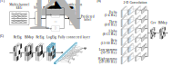

# FB-SPDDGNet for EEG-based emotion vocalisation decoding (thesis chapter supplementary code)

This repository implements the proposed FB-SPDDGNet architecture for cross-participant electroencephalogram (EEG) based emotion decoding during overt and imagined emotional vocalisations. The FB-SPDDGNet comprises three blocks: a feature extraction (FE) block, a Riemannian geometry-based domain-specific domain generalisation (DG) layer, and a classification block, illustrated in Figure 1. The DG layer is noval. It contains domain-specific adaptation modules which perform centring, scaling, rotating, and parallel shifting (bias) of symmetric positive definite (SPD) matrices separately for each domain to match SPD matrix distributions. We see each participant as an individual domain and associate one adaptation module to each participant. Detailes will be publically available when the thesis chapter (paper) is released/published.

> **Figure 1**: The proposed FB-SPDDGNet architecture consists of a EEG feature extraction (FE) block, a Riemannian geometry-based domain-specific domain generalisation (DG) layer, and a classification block. Panel (A) shows an illustration for the overall structure of FB-SPDDGNet. Given a trial belonging to a specific participant, the adaptation module for this participant (e.g., $\text{D}_1$) is activated while the rest (e.g., $\text{D}_2$, $\cdots$, $\text{D}_N$) are not used. Panel (B) shows an illustration for the FE block. The FE block comprises a filter-band of six bandpass filters, followed by two convolutional layers for extracting spatio-temporal EEG features and a temporal segmentation step. Then, the FE block computes covariance matrices from the temporal segments and applies a BiMap layer [1] to generate more compact and discriminative SPD matrices on a Riemannian manifold. Panel (C) illustrates the classification block, comprising ReEig and BiMap layers [1] for learning discriminative mappings of SPD matrices, a LogEig layer [1] for mapping the matrices onto a flat tangent space, a matrix vectorisation step, and finally a fully connected linear layer for multi-class classification.

## Evaluation against baseline methods

### Experiments

We evaluated the classification methods separately using EEG datasets collected for an overt and an imagined emotional vocalisation experiment. Briefly, the participants listened to emotional vocalisations in five emotion categories (i.e., anger, happiness, neutral, pleasure, sadness), selected from the Montreal Affective Voices (MAV) corpus [2]. Then, the participants recognised the emotion and produced vocalisations in the same emotion either overtly or by imagining. Fourteen participants (12 males and 2 females; 26.9±2.75 years) and sixteen participants (7 males and 9 females; 29.4±14.56 years) took part in the overt and imagined vocalisation experiments, respectively. We collected 64-channel EEGs for all participants positioned under an international 10-10 system, at a sampling rate of 2048 samples per second. We applied a band-pass filter between 1 and 100 Hz and a notch-filter at 50 Hz and 100 Hz, re-referenced the EEG recordings to the average across all channels, removed EOG contamination using the FastICA algorithm, truncated the EEG recordings into four-second epochs starting from the vocalisation onsets, and down-sampled the data to 256 samples per second. All trials in which the participants incorrectly recognised the emotion of the vocalisation were removed from further analysis.

### Baseline methods and classification framework

We evaluated the proposed FB-SPDDGNet against several baseline methods including non-neural network-based filter bank tangent space logistic regression (FBTSLR) [3], filter bank common spatial pattern (FBCSP) [4], as well as neural network-based EEGNet [5], ShallowFBCSPNet [6], and Tensor-CSPNet [7] models. For neural network-based methods, we also applied a DG method, classification and contrastive semantic alignment (CCSA) [8], for comparison against the proposed DG layer. We used a leave-N-participants-out classification framework (N=2). In each classification fold, we selected two participants as targets and the rest of the participants as sources. We randomly splitted the source participants' data into training (80%) and validation (20%) sets. From each target participant, we also select 5 trials per class as a calibration set to be used for fine-tune the trained models. We used the EEG data recorded from second block onwards from the target participants as the testing set. We trained the classifiers on the training set and used the validation set for hyper-parameter tuning (non-neural network methods) or selecting the best training iteration with the lowest validation loss (neural network). We fine-tuned the last layer (classification layer) of the neural networks using the calibration set. Finally, we evaluated the methods on the testing set using accuracy score. We repeated the above process until all participants were selected as target once. This resulted in 7 folds (14 participants / 2 participant per fold) for the overt and 8 folds (16/2) for the imagined vocalisation dataset. We repeated the evaluations for all neural networks for 10 times with random parameter initialisations for a more accurate evaluation result.

## Results

Table 1 summarises the cross-participant classification accuracies and the standard deviations across classification folds (leave-N-participants-out framework, N=2) for FB-SPDDGNet and baseline methods.

>**Table 1**: The proposed FB-SPDDGNet achieved the highest classification accuracies compared to multiple baseline classification methods and a DG algorithm (i.e., CCSA). All methods were evaluated under a leave-N-participants-out classification framework (N=2). All neural network models were evaluated ten times with random parameter initialisation. This table summarises the averaged classification accuracies (%) and the standard deviations across folds (14 participants / 2 participants per fold = 7 folds for the overt vocalisation dataset, and 16/2=8 folds for the imagined vocalisation dataset) for all methods in comparison. Chance=20% for both datasets.

| Method                 | Overt vocalisation     | Imagined vocalisation  |
|------------------------|------------------------|------------------------|
| FBTSLR                 | 31.80 ± 5.02           | 24.24 ± 4.26           |
| FBCSP                  | 29.12 ± 4.69           | 23.84 ± 3.81           |
| EEGNet                 | 43.90 ± 6.77           | 21.55 ± 2.28           |
| ShallowFBCSPNet        | 46.79 ± 7.74           | 23.58 ± 5.24           |
| Tensor-CSPNet          | 42.87 ± 4.67           | 25.95 ± 5.32           |
| EEGNet + CCSA          | 43.73 ± 7.23           | 22.49 ± 3.10           |
| ShallowFBCSPNet + CCSA | 41.88 ± 5.67           | 22.67 ± 3.56           |
| Tensor-CSPNet + CCSA   | 41.23 ± 4.51           | 24.79 ± 3.87           |
| **FB-SPDDGNet (proposed)** | **49.47 ± 9.00**      | **26.74 ± 4.63**       |

# References
[1] Zhiwu Huang and Luc Van Gool. A Riemannian network for SPD matrix learning. In Proceedings of the AAAI conference on artificial intelligence, volume 31, 2017.  
[2] Pascal Belin, Sarah Fillion-Bilodeau, and Frédéric Gosselin. The Montreal Affective Voices: A validated set of nonverbal affect bursts for research on auditory affective processing. Behavior research methods, 40(2):531–539, 2008.  
[3] Alexandre Barachant, Stéphane Bonnet, Marco Congedo, and Christian Jutten. Multiclass brain-computer interface classification by Riemannian geometry. IEEE Transactions on Biomedical Engineering, 59(4):920–928, 2011.  
[4] Kai Keng Ang, Zheng Yang Chin, Haihong Zhang, and Cuntai Guan. Filter bank common spatial pattern (FBCSP) in brain-computer interface. In 2008 IEEE international joint conference on neural networks (IEEE world congress on computational intelligence), pages 2390–2397. IEEE, 2008.  
[5] Vernon J Lawhern, Amelia J Solon, Nicholas R Waytowich, Stephen M Gordon, Chou P Hung, and Brent J Lance. EEGNet: a compact convolutional neural network for EEG-based brain-computer interfaces. Journal of Neural Engineering, 15(5):056013, 2018.  
[6] Robin Tibor Schirrmeister, Jost Tobias Springenberg, Lukas Dominique Josef Fiederer, Martin Glasstetter, Katharina Eggensperger, Michael Tangermann, Frank Hutter, Wolfram Burgard, and Tonio Ball. Deep learning with convolutional neural networks for EEG decoding and visualization. Human brain mapping, 38(11):5391–5420, 2017.  
[7] Ce Ju and Cuntai Guan. Tensor-cspnet: A novel geometric deep learning framework for motor imagery classification. IEEE Transactions on Neural Networks and Learning Systems, 34(12):10955–10969, 2022.  
[8] Saeid Motiian, Marco Piccirilli, Donald A Adjeroh, and Gianfranco Doretto. Unified deep supervised domain adaptation and generalization. In Proceedings of the IEEE international conference on computer vision, pages 5715–5725, 2017.
